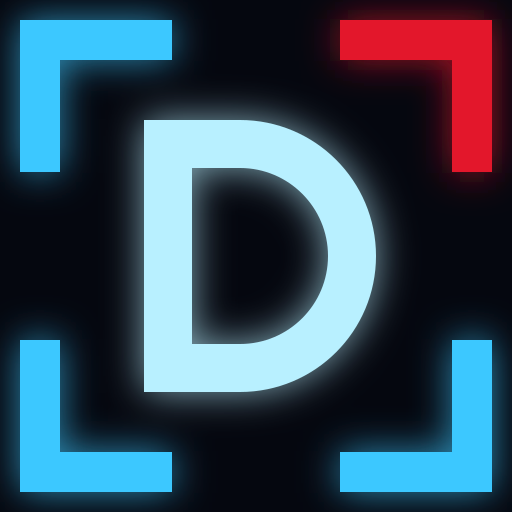

# Drilon Reçica - Portfolio

Builder and open-source home of Drilon Reçica: side projects, tools and one archived case study, styled as a dark Solo Leveling "System" interface. The professional profile, case studies and CV live at [recica.dev](https://recica.dev/); old `/cv` and case-study URLs here forward there.

## Tech Stack

-   **Framework**: [Astro](https://astro.build/) (v7) - static output, no UI framework. The only shipped JavaScript is Astro's view-transition router plus a few lines for the mobile menu.
-   **Content**: MDX content collection for the archived case study, typed data files for everything else.
-   **Styling**: [Tailwind CSS](https://tailwindcss.com/) (v4) with design tokens as CSS custom properties; one dark "System" palette shared with igris.
-   **Fonts**: Chakra Petch (self-hosted, OFL, in `public/fonts`) for headings and System labels; IBM Plex Mono via Fontsource; system sans for body text.
-   **Deployment**: GitHub Actions + GitHub Pages.

## Project Structure

```bash
/src
  /assets            # Images processed by Astro (portrait)
  /components        # Nav, SystemWindow, StatusWindow, SystemFooter, WorkCard, Figure, Icon
    /diagrams        # Inline SVG diagrams (case studies)
  /content/work      # Case studies (MDX)
  /data
    profile.ts       # Name, headline, intro, summary, links
    experience.ts    # Current employer (status window and structured data)
    work.ts          # Case-study query (drafts are dev-only)
  /layouts
    Layout.astro     # HTML shell, SEO, JSON-LD
  /pages
    index.astro      # Home
    work/[slug].astro  # Archived case study (/work/security-library)
    cv.astro         # Redirect to recica.dev/cv/
    work/deutsche-bahn.astro  # Redirect to recica.dev
    work/qisara.astro         # Redirect to recica.dev
    404.astro
  /styles
    global.css       # Tokens, base styles, components, diagram classes
  content.config.ts  # Schema for the work collection
/public              # Favicons, OG image, robots.txt
/docs                # Design spec for the redesign
```

## Getting Started

```bash
npm install
npm run dev        # http://localhost:4321
npx astro check    # type-check
npm run build      # production build into dist/
npm run build && npm test   # checks the built site, the token contrast and the System helpers
```

## Updating Content

-   **Headline, intro, summary, links**: edit `src/data/profile.ts`.
-   **Home sections**: the sections (hero, Shadow army, Quest log, Tools & labs, About, Contact) are in `src/pages/index.astro`; projects and tools are in `src/data/projects.ts`.
-   **Case studies**: add or edit an `.mdx` file in `src/content/work/`. Set `draft: true` to keep one out of production builds while you write; drafts still show in `npm run dev`.
-   **OG image**: replace `public/og-image.png` (1200x630). It shows the headline and the Status window.

## Deployment

Pushing to `master` deploys to GitHub Pages through `.github/workflows/deploy.yml`. In the repository settings, **Pages > Source** must be set to **GitHub Actions**.

## Quality bar

-   Lighthouse: 100 accessibility, 100 best practices, 100 SEO.
-   WCAG AA contrast (checked by `npm test`), visible keyboard focus, skip link, reduced-motion support.
-   Responsive from 320px up.
